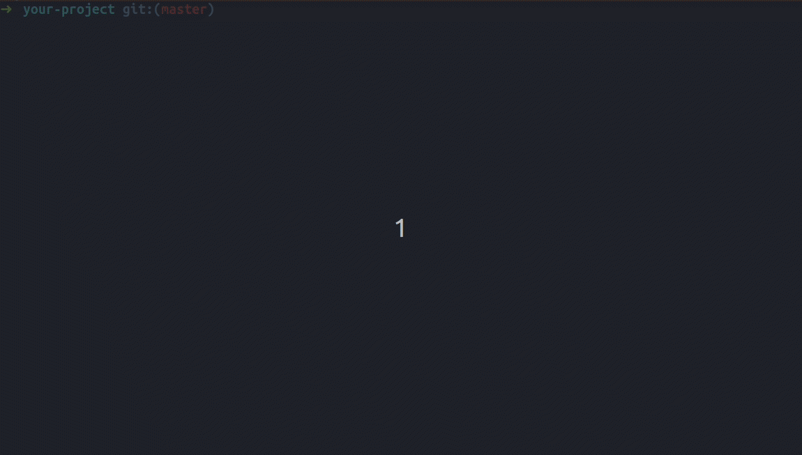

# :star2: changelog-generator-regex :book:
A simple and fast Node.js CLI, generating your changelog file with pretty sections.
<p align="center">
  
</p>

### Inspiration
Have you ever wanted to generate a changelog that fulfill your own needs ?<br/>
Most of the time, the tools you find don't fit exactly your needs or are just too complex to start with.

## changelog-generator-regex to the rescue !
This open source command line interface allow you to scrap your `git log` and catch what you need with "ready to go" regular expressions.<br/>
_Pssst ! It's customizable, enjoy !_ :balloon:
The CLI use default configuration and changelog files to speed up your experience. You are free to customize it to better match your needs.

## Features:
- Increment your project version in both your package.json and changelog file.
- Customize your changelog generation with regular expressions:
  - Ignore all commits you don't want, example: "Merge branch into...".
  - Compute the number of commits per category.
  - Generate changelog only for the new commits you didn't "change-logged" yet.
  - Link the author of the commit.
  - Share your configuration accross any project.

## Demo:

See the result example [below](https://github.com/RemyMachado/changelog-generator-regex/#Result-example)

## Installation:
with npm.<br/>
```
npm install --save-dev changelog-generator-regex
npm run changelog
```

with yarn.<br/>

```
yarn add --dev changelog-generator-regex
yarn changelog
```

## Result example:
_It starts next line:_<br/>
# Changelog

Each commit should match a `regular expression`:

- `/\[feat\]/` new feature
- `/\[chore\]/` maintain/improve existing features
- `/\[docs\]/` document anything related to the project
- `/\[fix\]/` correct a bug
- `/\[refactor\]/` improve code without changing behavior
- `/\[style\]/` format, add missing semi colons, fix linter warnings...
- `/\[test\]/` unit tests

_---> Here is the next release entry point <---_
## [1.0.0] - 2019-09-01
### feat: 6
>_new feature_
-  allow npm run commands by @RemyMachado
-  allow commit ignore configuration by @RemyMachado
-  allow user to customize regular expressions from configuration file by @RemyMachado
-  scrap the version inside package.json instead of changelog.md by @RemyMachado
-  use esm to load script by @RemyMachado
-  create a draft script by @RemyMachado
### chore: 3
>_maintain/improve existing features_
-  prepare the package for publication by @RemyMachado
-  improve readability of the type descriptions by @RemyMachado
-  use package dependencies by @RemyMachado
### docs: 4
>_document anything related to the project_
-  create usage example .gif by @RemyMachado
-  update readme.md with placeholders by @Rémy Machado
-  upload readme.md illustration by @RemyMachado
-  comment the process guideline by @RemyMachado
### fix: 2
>_correct a bug_
-  version scrapping call by @RemyMachado
-  correct single digit overflow by @RemyMachado
### refactor: 8
>_improve code without changing behavior_
-  replace with new name (regex) by @RemyMachado
-  use constants for return codes by @RemyMachado
-  clean the main file of any other functions by @RemyMachado
-  use constants for print colors and version types by @RemyMachado
-  add helpers to modulate the features by @RemyMachado
-  externalize system functions by @RemyMachado
-  externalize user interactions by @RemyMachado
-  externalize string constants by @RemyMachado
### style: 1
>_format, add missing semi colons, fix linter warnings..._
-  enforce prettier on js files by @RemyMachado
### untyped: 1
>_not recognized commit type_
- Initial commit by @Rémy Machado

_It ends here_

## Contributing :bowtie:
Feel free to create issues or pull requests, your help is precious.

## License :scroll:
[MIT](https://en.wikipedia.org/wiki/MIT_License)
